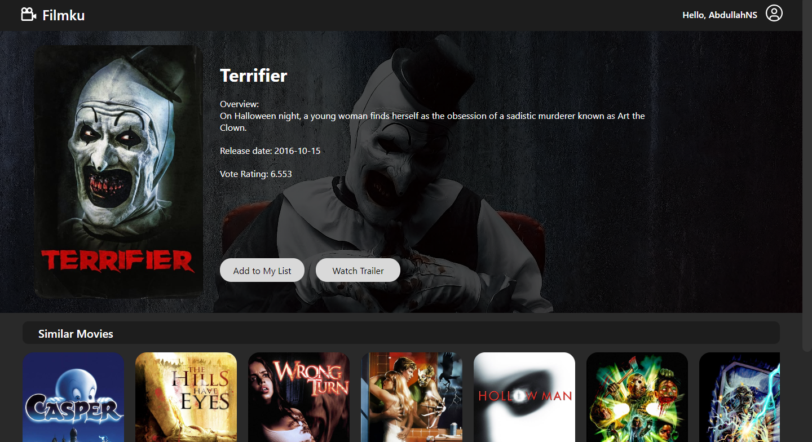
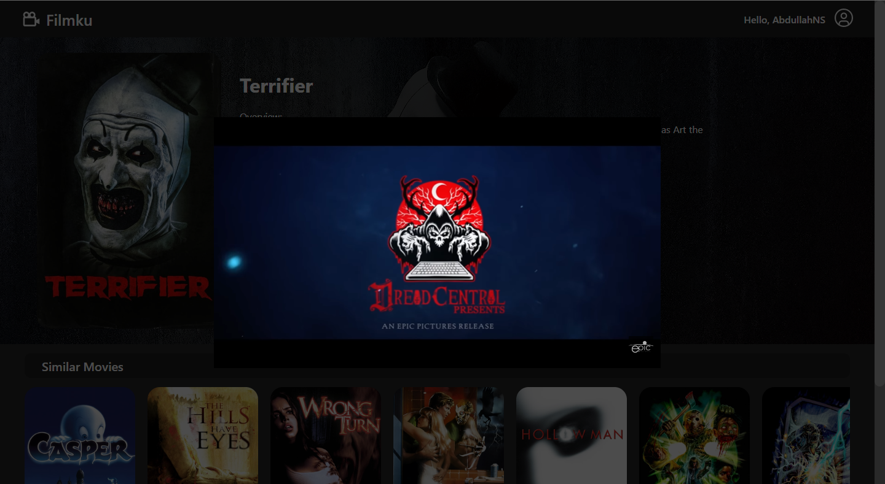
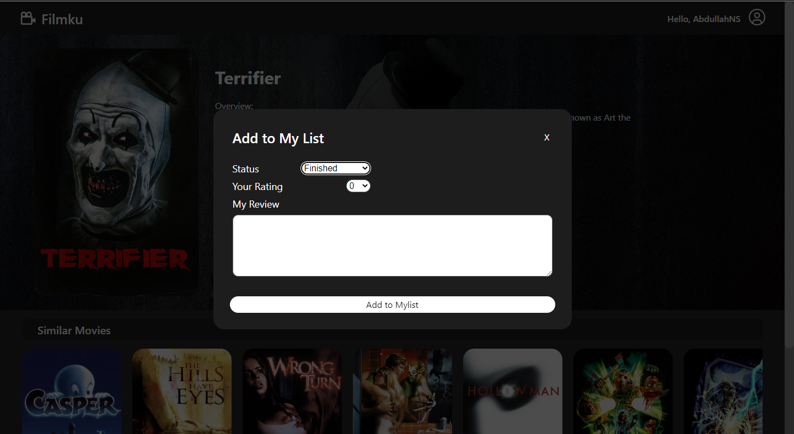
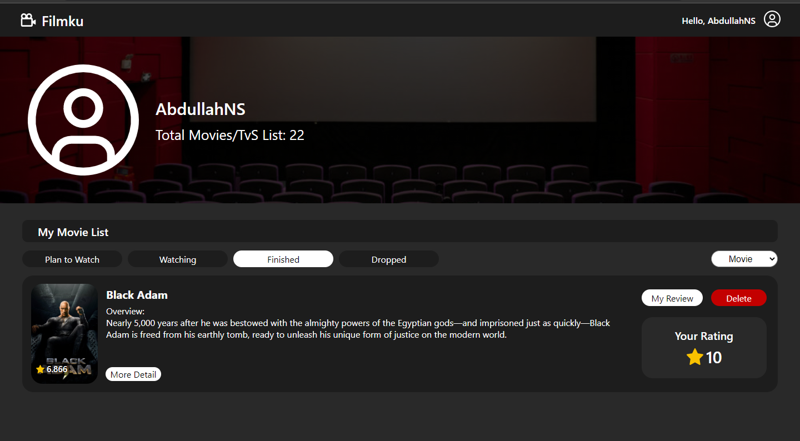
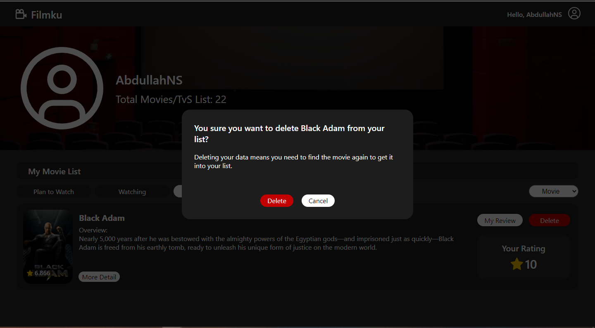
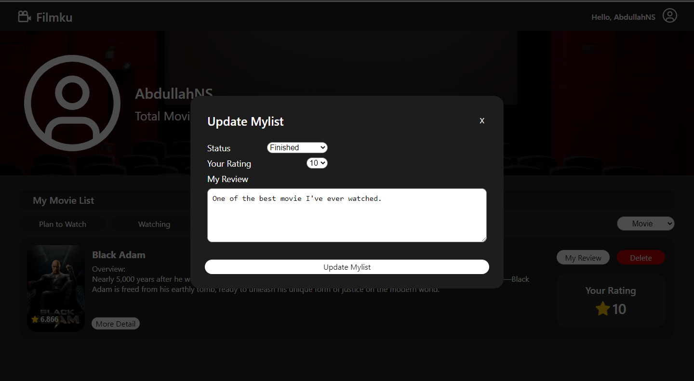

# F8lmKu

The project that are made with an idea of a simple version of any movie/series app, for the people that one simplicity

## Mini Project

Mini project ini dikerjakan untuk memenuhi tugas yang telah diberikan alterra untuk mendapatkan nilai dari mentor, dan juga sebagai ide sebagaimana hal-hal baru yang bisa kita buat dengan menggunakan React JS yang baru saya pelajari.

### Tampilan Home

Tampilan Home berisikan list movie/series berdasarkan menu tab yang dipilih movie/series yang dibagi menjadi tiga tipe bagian, yaitu Popular, Top, dan juga upcoming. Dapat dilihat pada foto berikut untuk bagian home dari aplikasi.\
;

### Tampilan detail

Pada detail user disini bisa melihat tampilan poster dan backdrop, lalu user juga bisa melihat trailer dalam bentuk modal pada saat user mengklik watch trailer yang berada pada bagian sebalah poster, lalu user juga bisa menambahkan movie/serie tersebut kedalam sebuah list pada user yang sudah memiliki akun.\

Berikut adalah foto dari tampilan detail.\
\

Dan berikut merupakan tampilan saat user mengklik Watch Trailer.\
\

Lalu pada bagian berikut tampilan modal pada saat user ingin memasukkan movie/series kedalam list.\

### Userpage

Halaman user ini dibuat untuk user dapat melihat list-list movie/series yang telah user tambahkan kepada akun yang terdaftar, dibagian ini juga, user bisa update status dari movie/series yang berada pada di list, dan juga bisa menghapus movie/serie yang sudah ditambahkan kedalam list oleh user.\

Berikut adalah tampilan dari userpage.\
\

Berikut adalah gambaran user saat mau delete list.\
\

Berikut adalah tampilan dari user jika ingin update status ataupun review yang telah dimasukkan.\
